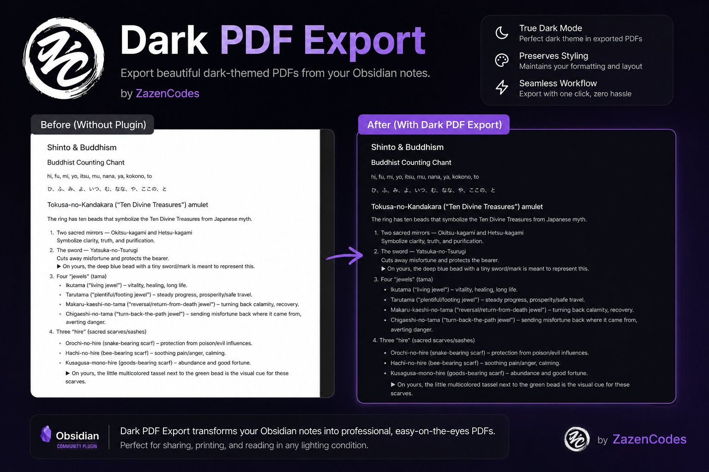

# Dark PDF Export

Dark PDF Export is a desktop plugin for Obsidian by [ZazenCodes](https://zazencodes.com/).

It applies a stable dark stylesheet to Obsidian's native **Export to PDF** workflow.

Styles can be customized interactively using the **Style Settings** community plugin.



## Use

Install "Dark PDF Export" from the Obsidian community plugins marketplace or
[install manually](#manual-installation).

Enable the plugin, open a note, and use Obsidian's native **Export to PDF** command. Dark PDF styling is enabled by default when the plugin is first turned on.

The plugin settings page under **Settings → Community plugins → Dark PDF Export** contains a toggle:

- **Enable dark PDF styling** turns dark PDF export styling on or off.

## Customizing Styles

Use the [Style Settings](https://github.com/mgmeyers/obsidian-style-settings) community plugin. Dark PDF Export automatically registers a configuration panel under **Settings → Style Settings → Dark PDF Export**.

You can visually customize color swatches using native color pickers for:
- **Page background** (`--dark-pdf-background`): The base background color for the PDF page.
- **Surface background** (`--dark-pdf-surface`): Background for code blocks, inline code, and callouts.
- **Border color** (`--dark-pdf-border`): Borders for tables, blockquotes, and dividers.
- **Body text** (`--dark-pdf-text`): Main paragraph and list text.
- **Headings** (`--dark-pdf-heading`): Headings H1 through H6 and inline titles.
- **Muted text** (`--dark-pdf-muted`): Faint metadata, footnotes, and secondary text.
- **Links and accents** (`--dark-pdf-accent`): Internal/external links and highlighted accents.

Changes made in Style Settings take effect immediately on your next export without requiring a vault reload.

## Manual installation

1. Download `main.js`, `manifest.json`, and `styles.css` from the same GitHub release.
2. Create `<vault>/.obsidian/plugins/dark-pdf-export/`.
3. Copy all three files into that folder.
4. Restart or reload Obsidian, then enable **Dark PDF Export** under **Settings → Community plugins**.

The folder name must match the plugin ID: `dark-pdf-export`. The plugin requires desktop Obsidian 1.12.0 or newer.

## Privacy and safety

Dark PDF Export works locally. It has no account, ads, telemetry, analytics, or network requests. It does not read or modify notes, attachments, vault metadata, themes, snippets, appearance settings, or other plugins' settings. Plugin settings are stored only through Obsidian's supported plugin data API; the runtime contains no hard-coded vault or `.obsidian` path.

## Development

Node.js 24 and npm are used for reproducible development and CI.

```sh
npm ci
npm run typecheck
npm run lint -- --max-warnings=0
npm test
npm run build
npm run release:validate -- 1.0.0
```

`npm run dev` starts the esbuild watcher. Production builds are minified and write the `main.js` bundle. A release consists of `main.js`, `manifest.json`, and `styles.css` from one production build.

## Releases

1. If compatibility changed, update `minAppVersion` in `manifest.json` and commit that compatibility change first.
2. Run `npm version patch`, `npm version minor`, or `npm version major`. The version hook updates `manifest.json` and maps the release to its minimum Obsidian version in `versions.json`. npm tags use the exact unprefixed `x.y.z` version.
3. Run the complete development checks above and push the source commit and tag.
4. The release workflow validates the package, manifest, tag, and compatibility mapping before building. A mismatch stops the workflow.
5. The workflow creates a draft GitHub release with the three required assets. Review its notes and assets before publishing it.

Before the initial Community directory submission, complete Obsidian's current [plugin self-critique](https://docs.obsidian.md/oo/plugin), publish the `1.0.0` release, and [submit the repository](https://docs.obsidian.md/Plugins/Releasing/Submit%20your%20plugin). The Community directory runs automated review; fix any findings in source and publish a new incremented release rather than reusing a version number.

## Support

Report bugs and compatibility problems through [GitHub Issues](https://github.com/zazencodes/obsidian-dark-pdf-export/issues). Include your Obsidian version, plugin version, operating system, and a minimal CSS or export example when relevant.

## License

[MIT](LICENSE) © ZazenCodes.
