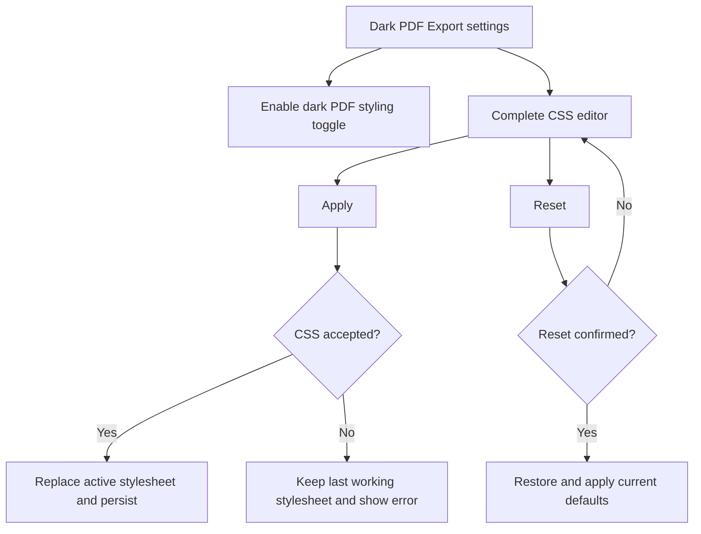
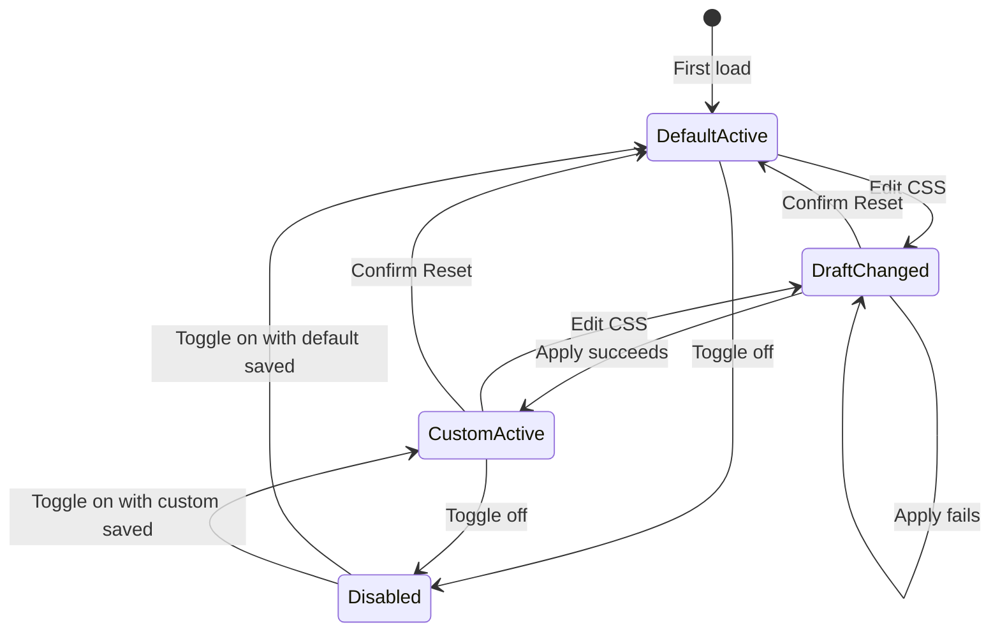

# Dark PDF Export - Plan

## Goal Capsule

- **Objective:** Ship a focused Obsidian Community Plugin that makes Obsidian's native PDF export produce a polished dark document and lets advanced users edit the complete print stylesheet.
- **Product authority:** This contract defines the version 1 product behavior, public identity, scope, acceptance signals, and route into the Obsidian Community Plugins directory.
- **Open blockers:** None before implementation planning. A plugin-managed stylesheet must pass the feasibility and Community review compliance spike in R36 before the full settings implementation proceeds.
- **Execution profile:** Desktop Obsidian plugin, public source repository, GitHub Releases distribution, and Community Plugins submission.

---

## Product Contract

### Summary

Dark PDF Export will be a narrowly scoped desktop plugin that applies a dependable dark stylesheet to Obsidian's native Markdown-to-PDF export.
It will be enabled by default and expose only an on/off switch plus an editor for the complete effective CSS, with explicit Apply and Reset controls.

### Problem Frame

Obsidian's PDF appearance is controlled by print CSS, but a theme that looks dark inside the app can still export a PDF with white page margins or a light page box.
The prototype proved that styling the rendered Markdown container is insufficient: Chromium's printed page box must also receive an `@page` background.

The working vault snippet solved the immediate problem, including a follow-up correction for the white border.
Packaging that behavior as a plugin removes the need for users to discover print CSS, maintain a snippet, or understand the distinction between an embedded-PDF inversion setting and Markdown-to-PDF export styling.

### Product Identity

- **Display name:** Dark PDF Export
- **Plugin ID:** `dark-pdf-export`
- **Repository:** `zazencodes/obsidian-dark-pdf-export`
- **Repository URL:** <https://github.com/zazencodes/obsidian-dark-pdf-export>
- **Local development path:** `~/pro/obsidian-dark-pdf-export` for the owner; this machine-specific path is not part of the product interface.
- **One-line promise:** Export Obsidian notes as clean dark-mode PDFs using the native PDF exporter.
- **Primary user:** A desktop Obsidian user who wants dark PDFs without replacing Obsidian's export workflow.

### Key Decisions

- **Stay narrowly focused on dark native PDF export.** (session-settled: user-directed — chosen over a broader PDF theming or export suite: one dependable outcome is the product.) Governs R1-R4, R22-R25.
- **Enable the dark stylesheet immediately.** (session-settled: user-approved — chosen over requiring a second opt-in after plugin activation: enabling a single-purpose plugin communicates intent.) Governs R1, R5.
- **Use a stable built-in palette.** (session-settled: user-approved — chosen over inheriting the active Obsidian theme: output should remain predictable across community themes.) Governs R2-R4.
- **Expose only an on/off switch and the full CSS editor.** (session-settled: user-directed — chosen over color fields, presets, and other friendly controls: advanced users should have complete control without expanding the settings surface.) Governs R5-R13.
- **Require Apply before CSS changes take effect.** (session-settled: user-approved — chosen over live application: incomplete edits must not destabilize the active stylesheet.) Governs R8-R11.
- **Name the product Dark PDF Export.** (session-settled: user-directed — chosen over PDF Darkroom and Darkprint: the descriptive name is clearer and more searchable.) Governs R26-R28.
- **Use `obsidian-dark-pdf-export` for the repository and treat `dark-pdf-export` as the project's immutable plugin ID.** (session-settled: user-directed — chosen to follow the common repository naming convention while satisfying the manifest rule that IDs cannot contain `obsidian`.) Governs R26-R28.

### Actors

- A1. **Plugin user:** Installs the plugin, exports notes, enables or disables the dark stylesheet, and optionally edits its CSS.
- A2. **Plugin maintainer:** Publishes releases, preserves user CSS across upgrades, responds to compatibility changes, and maintains Community Plugin compliance.
- A3. **Obsidian desktop:** Loads the plugin, persists plugin data, renders the native export, and downloads release artifacts.
- A4. **Obsidian Community directory:** Validates the initial submission and makes approved releases discoverable and installable.

### Requirements

**Core export behavior**

- R1. When the plugin is enabled for the first time, dark PDF styling must be active without requiring another opt-in.
- R2. The default stylesheet must produce a neutral near-black page, readable light body text, brighter headings, muted secondary text, visible links, dark code surfaces, and visible borders.
- R3. The default stylesheet must color the complete printed page box on every page, including the area outside the Markdown content container.
- R4. The default stylesheet must preserve background colors during Chromium printing and must not invert embedded images or other document media.
- R5. A persisted on/off switch must control whether the effective stylesheet is attached; turning it off must restore Obsidian's ordinary export styling without deleting the saved CSS.
- R6. The default stylesheet must target print and export rendering without changing ordinary editing, Reading view, or the appearance of PDFs embedded in notes.
- R7. Disabling or uninstalling the plugin must remove all runtime styling it added without modifying notes, themes, CSS snippets, or Obsidian's appearance configuration.

**CSS ownership and editing**

- R8. The settings tab must show the complete effective stylesheet rather than a separate override fragment.
- R9. Editing the text area must create a draft only; the active stylesheet must remain unchanged until the user presses Apply.
- R10. Apply must validate the draft with a browser-compatible CSS parser before replacing the last working stylesheet.
- R11. If the parser reports a fatal failure, Apply must keep the last working stylesheet active and identify the failure without discarding the draft.
- R12. Reset must require confirmation, replace both the draft and active stylesheet with the defaults shipped by the installed plugin version, and preserve the reset result as user data.
- R13. The settings interface must contain only the persisted styling toggle, the CSS editor, Apply, and Reset; validation messages and explanatory text are feedback rather than additional settings.
- R14. The editor must warn that it accepts a complete stylesheet and that selectors outside print media can affect the Obsidian interface.
- R15. Custom CSS must survive Obsidian restarts, plugin reloads, and plugin upgrades until the user resets or replaces it.
- R16. A plugin upgrade must not overwrite customized CSS; users who never customized or reset the stylesheet may receive the new release's current defaults.
- R17. CSS is trusted local user input, but the plugin must not evaluate it as JavaScript, send it over the network, or interpolate it into HTML.

**Privacy, safety, and compatibility**

- R18. The plugin must perform no network requests, collect no telemetry, require no account, and include no advertising.
- R19. The plugin must not read or modify note contents, attachments, vault metadata, theme files, snippet files, or unrelated plugin settings.
- R20. Plugin data must be stored through Obsidian's supported plugin data APIs rather than hard-coded access to the `.obsidian` directory.
- R21. The manifest must declare the plugin desktop-only because the product depends on Obsidian's desktop PDF export behavior.
- R22. The default stylesheet must remain usable with both Obsidian's light and dark application modes and must not depend on the active community theme's palette.
- R23. The plugin must fail closed: if its saved data is missing or unreadable, it must load the shipped default stylesheet rather than inject partial or corrupt CSS.

**Repository and package identity**

- R24. Source code and project documentation must live in the public GitHub repository `zazencodes/obsidian-dark-pdf-export`.
- R25. The project must carry a permissive open-source license; MIT is the default assumption unless the owner chooses another license before the first release.
- R26. `manifest.json` must use `dark-pdf-export` as its immutable ID and `Dark PDF Export` as its display name.
- R27. The repository may contain `obsidian` in its name, but the plugin ID and display name must comply with Obsidian's current naming rules.
- R28. The initial public release must use Semantic Versioning in `x.y.z` form and should begin at `1.0.0` once the acceptance examples in this contract pass.
- R29. The repository must include a root README that explains the narrow purpose, installation, use, CSS editing risk, reset behavior, compatibility, privacy posture, development, and support route.

**Quality and release readiness**

- R30. Continuous integration must build, type-check, lint, and test the plugin from a clean checkout with the committed package-manager lock file.
- R31. Production builds must be minified and must not commit generated `main.js` to the source branch unless current Obsidian submission guidance changes.
- R32. A versioned release must attach `main.js`, `manifest.json`, and `styles.css` when the build produces it; the release tag must exactly match the manifest version without a `v` prefix.
- R33. `versions.json` must map releases to the minimum supported Obsidian version whenever compatibility requirements change.
- R34. Release automation must refuse to publish when package, manifest, tag, or compatibility versions disagree.
- R35. Before Community directory submission, the plugin must pass the current Obsidian plugin self-critique; after submission, it must pass the directory's automated review before the plugin becomes installable.
- R36. Before full implementation proceeds, a minimal plugin spike must prove that a plugin-managed user stylesheet reaches Obsidian's native PDF print context and has a defensible path through the guideline against assigning styles in JavaScript.

### Settings Surface

The settings tab has one narrow interaction surface.
It should use Obsidian components, sentence-case labels, keyboard-accessible controls, and no decorative headings when only one section exists.



No live preview, preset picker, color field, font control, page-size control, import/export control, or per-note option belongs in version 1.

### State Model

The implementation must keep the editor draft distinct from the active and persisted stylesheet.



The diagram describes product state, not required code structure.

### Key Flows

- F1. First install and export
  - **Trigger:** A1 installs and enables the plugin for the first time.
  - **Actors:** A1, A3
  - **Steps:** The plugin loads its defaults, attaches the dark stylesheet, and A1 uses Obsidian's existing Export to PDF command.
  - **Outcome:** Every PDF page renders with the dark page box and readable default palette.
  - **Covered by:** R1-R7, R21-R23.
- F2. Apply valid custom CSS
  - **Trigger:** A1 edits the complete stylesheet and presses Apply.
  - **Actors:** A1, A3
  - **Steps:** The plugin validates the draft, replaces the active style only after acceptance, persists it, and reports success.
  - **Outcome:** Later exports use the custom stylesheet and the customization survives restarts and upgrades.
  - **Covered by:** R8-R10, R15-R17.
- F3. Reject invalid custom CSS
  - **Trigger:** A1 presses Apply with a stylesheet that produces a fatal parser failure.
  - **Actors:** A1, A3
  - **Steps:** The plugin reports the failure, leaves the draft available for correction, and retains the previous active style.
  - **Outcome:** Export remains functional with the last working stylesheet.
  - **Covered by:** R10-R11, R23.
- F4. Reset customization
  - **Trigger:** A1 presses Reset and confirms the destructive action.
  - **Actors:** A1, A3
  - **Steps:** The plugin replaces the draft and active stylesheet with the defaults bundled in the installed version and persists that result.
  - **Outcome:** The user returns to a known-good current default.
  - **Covered by:** R12, R16.
- F5. Temporarily disable styling
  - **Trigger:** A1 turns off dark PDF styling.
  - **Actors:** A1, A3
  - **Steps:** The plugin removes its active stylesheet but preserves the saved CSS.
  - **Outcome:** Native export returns to its ordinary appearance and the prior stylesheet returns when the toggle is re-enabled.
  - **Covered by:** R5, R7.
- F6. Publish and submit
  - **Trigger:** A2 has a release candidate that passes this contract.
  - **Actors:** A2, A3, A4
  - **Steps:** CI verifies the source, release automation publishes matching assets, A2 submits the repository through the Community directory, and A2 addresses automated review feedback with incremented releases.
  - **Outcome:** Users can install the plugin from Obsidian's Community Plugins browser.
  - **Covered by:** R24-R36.

### Acceptance Examples

- AE1. Default multipage export
  - **Covers R1-R4, R22.**
  - **Given:** A fresh install, the shipped stylesheet, and a multipage note containing headings, paragraphs, links, lists, tasks, tables, code, blockquotes, callouts, images, math, footnotes, and explicit page breaks.
  - **When:** The user exports with Obsidian's native Export to PDF command.
  - **Then:** Every page is dark to its physical edges, content remains legible, backgrounds are preserved, and media is not inverted.
- AE2. Independence from the active theme
  - **Covers R2, R6, R22.**
  - **Given:** The same representative note under the default theme and at least two materially different community themes in both light and dark application modes.
  - **When:** The user exports using the shipped stylesheet.
  - **Then:** The PDF uses the plugin's stable palette while the ordinary Obsidian workspace retains its theme appearance.
- AE3. Toggle off and on
  - **Covers R5, R7.**
  - **Given:** A customized stylesheet is active.
  - **When:** The user turns styling off, exports, then turns styling on and exports again.
  - **Then:** The first export uses ordinary Obsidian styling, the second uses the same saved custom stylesheet, and no other configuration changes.
- AE4. Draft isolation
  - **Covers R8-R10.**
  - **Given:** A working stylesheet is active and the user has edited the settings text area without applying it.
  - **When:** The user exports a note or closes settings.
  - **Then:** The active and persisted stylesheet remains the last applied version.
- AE5. Invalid CSS recovery
  - **Covers R10-R11, R23.**
  - **Given:** A working stylesheet is active and the editor contains CSS that triggers a fatal validation failure.
  - **When:** The user presses Apply.
  - **Then:** The user receives actionable feedback, the draft remains editable, and the prior stylesheet remains active.
- AE6. Reset
  - **Covers R12, R16.**
  - **Given:** Custom CSS is active.
  - **When:** The user presses Reset and declines confirmation.
  - **Then:** Nothing changes.
  - **When:** The user presses Reset again and confirms.
  - **Then:** The installed version's default CSS becomes both the editor content and active persisted stylesheet.
- AE7. Restart and upgrade persistence
  - **Covers R15-R16.**
  - **Given:** Custom CSS is active.
  - **When:** Obsidian restarts, the plugin reloads, or the plugin upgrades.
  - **Then:** The exact custom CSS remains active until the user changes or resets it.
- AE8. Clean unload
  - **Covers R7, R19.**
  - **Given:** Dark styling is active.
  - **When:** The plugin is disabled or uninstalled.
  - **Then:** Its runtime style is gone and no notes, snippets, theme files, or appearance settings were changed.
- AE9. Release installability
  - **Covers R26-R35.**
  - **Given:** A clean vault on the declared minimum Obsidian version and a GitHub release whose tag matches `manifest.json`.
  - **When:** The release assets are installed manually or through a beta installer.
  - **Then:** Obsidian recognizes `dark-pdf-export`, loads it without console errors, and all required settings and export behavior work.
- AE10. Plugin-managed print stylesheet feasibility
  - **Covers R6-R7, R19, R36.**
  - **Given:** A minimal development plugin applies a distinctive test-only print background through the proposed user-stylesheet lifecycle.
  - **When:** A note is exported through Obsidian's native PDF command and the plugin is then disabled.
  - **Then:** The exported page uses the test background, the ordinary workspace remains unchanged, disabling removes the style, and the approach has a documented compliance rationale against current plugin guidance.

### Default Stylesheet Contract

The shipped stylesheet should begin from the proven vault snippet, simplified to remove Style Settings metadata because this plugin owns persistence and editing.
The implementation may reorganize selectors only if the visual and isolation requirements remain true.

```css
body {
  --dark-pdf-background: #0b0b0b;
  --dark-pdf-surface: #161616;
  --dark-pdf-border: #363636;
  --dark-pdf-text: #c8c8c8;
  --dark-pdf-heading: #eeeeee;
  --dark-pdf-muted: #999999;
  --dark-pdf-accent: #b18cfe;
}

@page {
  background: #0b0b0b;
}

@media print {
  html,
  body,
  body.print,
  .print,
  .print .markdown-preview-view,
  .print .markdown-preview-sizer {
    background: var(--dark-pdf-background) !important;
    color: var(--dark-pdf-text) !important;
    color-scheme: dark;
    -webkit-print-color-adjust: exact !important;
    print-color-adjust: exact !important;
  }

  body,
  body.print {
    --background-primary: var(--dark-pdf-background);
    --background-primary-alt: var(--dark-pdf-surface);
    --background-secondary: var(--dark-pdf-surface);
    --background-secondary-alt: var(--dark-pdf-surface);
    --background-modifier-border: var(--dark-pdf-border);
    --background-modifier-border-hover: var(--dark-pdf-border);
    --code-background: var(--dark-pdf-surface);
    --text-normal: var(--dark-pdf-text);
    --text-muted: var(--dark-pdf-muted);
    --text-faint: var(--dark-pdf-muted);
    --text-accent: var(--dark-pdf-accent);
    --text-accent-hover: var(--dark-pdf-accent);
    --interactive-accent: var(--dark-pdf-accent);
    --blockquote-border-color: var(--dark-pdf-border);
    --table-border-color: var(--dark-pdf-border);
  }

  .print :is(.inline-title, h1, h2, h3, h4, h5, h6) {
    color: var(--dark-pdf-heading) !important;
  }

  .print :is(a, a.external-link, .internal-link) {
    color: var(--dark-pdf-accent) !important;
  }

  .print :is(pre, code, table, blockquote, .callout, .metadata-container) {
    -webkit-print-color-adjust: exact !important;
    print-color-adjust: exact !important;
  }
}
```

The literal `@page` value matches the proven prototype and must remain synchronized with the default background.
Planning may test a root-scoped custom property as a maintainability improvement, but the release must retain an opaque page-box fallback so missing or renamed variables cannot restore the white frame.

### Verification Matrix

| Area | Minimum coverage | Pass signal |
|---|---|---|
| Settings persistence | First load, toggle, apply, reset, reload, upgrade migration | Active, draft, and saved states match R5 and R8-R16 |
| CSS lifecycle | Load, successful apply, failed apply, toggle, unload | Exactly one intended style source is active and cleanup is complete |
| Feasibility and compliance | R36 minimal plugin spike and current guideline review | Plugin-managed CSS reaches native PDF export and has a documented submission path |
| Export visuals | Representative one-page and multipage fixture notes | No white page frame, clipping, unreadable content, or unintended image inversion |
| Theme isolation | Default plus contrasting community themes in light and dark modes | Screen UI remains unchanged and export palette remains stable |
| Native export options | Letter and A4, ordinary and zero-margin configurations, multipage output | Dark page coverage and readable content survive supported combinations |
| Accessibility | Keyboard navigation, labels, focus, editor readability, error feedback | Settings are operable without a pointer and feedback is perceivable |
| Privacy and safety | Static analysis and runtime inspection | No network, telemetry, vault content access, or permanent vault mutations |
| Packaging | Clean install from release assets | Manifest, main bundle, optional styles, and versions metadata agree |
| Community readiness | Self-critique before submission, then automated directory review | No unresolved blocking findings before the plugin becomes installable |

### Success Criteria

- A new user can enable the plugin and produce a borderless dark PDF through Obsidian's existing export command without reading setup instructions.
- A technical user can see, edit, apply, recover, and reset the complete stylesheet without touching vault configuration files.
- The plugin never changes the visible workspace unless the user places non-print selectors in custom CSS after seeing the warning.
- Custom CSS is not lost during restart, reload, disable/re-enable, or upgrade flows.
- The project can publish a compliant release and enter the Community Plugins directory without changing its product identity; packaging details may adapt to satisfy review.
- A new coding agent can derive implementation structure and tests from this contract without inventing user behavior.

### Scope Boundaries

**Deferred for later**

- Optional import and export of stylesheet files if real users need to share configurations.
- A curated gallery of community styles if demand emerges without compromising the narrow settings surface.
- Automated visual regression coverage across more operating systems and Obsidian versions after the first stable release.

**Outside this product's identity**

- A replacement PDF rendering engine, export modal, preview window, or alternate export command.
- Theme inheritance, palette extraction, light-mode export, multiple presets, or per-note styling controls.
- Friendly color pickers, typography controls, page-size controls, headers, footers, page numbers, watermarks, covers, merged exports, and document templating.
- Editing note content, frontmatter, attachments, embedded PDFs, or the appearance of the Obsidian workspace.
- Mobile PDF export.
- Cloud services, accounts, synchronization, analytics, advertising, or monetization in version 1.

### Dependencies and Assumptions

- Obsidian desktop continues to expose native PDF export and load plugin-provided CSS into its print context.
- Chromium continues to honor `@page` background declarations and `print-color-adjust: exact` in Obsidian's Electron runtime.
- Obsidian's supported plugin data APIs are sufficient for the toggle, draft, active CSS, and default-version metadata.
- Full CSS editing appears to require dynamic application of user-authored CSS, but the prototype proves snippet behavior rather than plugin-managed style behavior; R36 must validate both print propagation and the Community review posture before the full build.
- CSS parsing in browsers is intentionally tolerant, so validation can guarantee rejection of fatal parse failures but cannot promise that every unsupported declaration will be treated as an error.
- MIT is the assumed license for planning; the owner may substitute another Community-compatible license before the first release.
- The exact minimum Obsidian version should be the oldest version on which the chosen settings and lifecycle APIs pass the full verification matrix.

### Risks and Mitigations

- **Obsidian print DOM changes:** Centralize the shipped selectors, test against current public and insider builds before release, and treat a white page edge or missing content as a release blocker.
- **Theme specificity conflicts:** Keep export selectors narrow, use the stable plugin palette, and retain `!important` only where needed to override theme print rules.
- **Custom CSS affects the workspace:** Warn that the editor accepts a complete stylesheet, ship print-scoped defaults, and make Reset recovery obvious.
- **Tolerant CSS parsing hides mistakes:** Preserve the last working stylesheet, surface parser warnings where available, and avoid claiming perfect linting.
- **Dynamic CSS may conflict with review guidance:** Run R36 first, keep any runtime application limited to user-authored product data, avoid inline component styling, explain the necessity, and stop for product direction if compliance would require removing the full CSS editor.
- **Default evolution conflicts with customization:** Version the bundled default separately from user data and never overwrite a customized stylesheet during upgrades.
- **Marketplace naming changes before submission:** Recheck both display name and ID against the live Community Plugins registry immediately before the first release.
- **Submission guidance changes:** Treat the official developer documentation as authority at release time rather than copying an old pull-request workflow.

### Beta and Release Path

1. Build and test locally in a disposable or dedicated development vault whose plugin folder matches `dark-pdf-export`.
2. Install the production artifacts manually into a clean vault and run the verification matrix.
3. Publish a prerelease for trusted testers; BRAT may be used for beta installation because the official releases repository recommends it for public beta testing.
4. Resolve beta defects, update documentation, and produce the release candidate.
5. Set the manifest and package versions to `1.0.0`, update compatibility metadata, and create a GitHub release tagged exactly `1.0.0`.
6. Attach `main.js`, `manifest.json`, and `styles.css` when present to that release.
7. Sign in at <https://community.obsidian.md>, link the maintainer's GitHub account, choose **Plugins** then **New plugin**, and submit the repository URL.
8. Address automated review feedback through source changes and incremented GitHub releases; do not reuse a published version number.
9. Publish the directory entry after automated review passes and complete any human review requested by Obsidian.
10. After listing, announce through the Obsidian forum's Share and showcase category and the Discord `#updates` channel if desired.

Only the initial version is submitted through the directory workflow.
Subsequent compatible releases are discovered through GitHub based on the root manifest, matching release tag, and release assets.

### Sources and Research

- [Obsidian sample plugin](https://github.com/obsidianmd/obsidian-sample-plugin) — official TypeScript project shape, build tooling, linting, version bumping, and release asset example.
- [Build a plugin](https://docs.obsidian.md/Plugins/Getting%20started/Build%20a%20plugin) — official development-vault and build workflow.
- [Manifest reference](https://docs.obsidian.md/Reference/Manifest) — required manifest fields, naming constraints, `isDesktopOnly`, and plugin-folder ID behavior.
- [Versions reference](https://docs.obsidian.md/Reference/Versions) — compatibility lookup behavior and when `versions.json` changes are required.
- [Submit your plugin](https://docs.obsidian.md/Plugins/Releasing/Submit%20your%20plugin) — current Community directory submission, release, ownership verification, and review process.
- [Plugin self-critique](https://docs.obsidian.md/oo/plugin) — current release-readiness checklist covering code style, settings UI, privacy, security, compatibility, and performance.
- [Community plugins registry](https://github.com/obsidianmd/obsidian-releases/blob/master/community-plugins.json) — live uniqueness check for the name and ID before submission.
- [Community releases repository](https://github.com/obsidianmd/obsidian-releases) — how Obsidian resolves manifests, compatibility metadata, GitHub releases, and beta guidance.
- [Prototype stylesheet after initial implementation](https://github.com/zazencodes/azath-house/blob/9053c34/.obsidian/snippets/dark-pdf-export.css) — the first complete dark export snippet.
- [Prototype white-border correction](https://github.com/zazencodes/azath-house/blob/5181e1d/.obsidian/snippets/dark-pdf-export.css) — the `@page` correction that colored the PDF page box.

### Deferred to Planning

- Choose the minimum supported Obsidian version from the oldest version that supports the selected settings implementation and passes the verification matrix.
- Choose the smallest browser-compatible CSS validation mechanism that distinguishes fatal failures without rejecting valid modern print CSS.
- Choose the compliant stylesheet lifecycle only after R36 proves that the mechanism reaches native PDF export and is acceptable under current plugin guidance.
- Decide whether the complete editable stylesheet is persisted as one value or as active, draft, and default-version fields while preserving the state behavior in R8-R16.
- Decide whether to adapt the official sample plugin directly or reproduce its current structure with only the files this focused plugin needs.
- Confirm MIT as the license or record the owner's replacement before the first public release.
